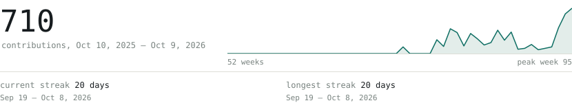
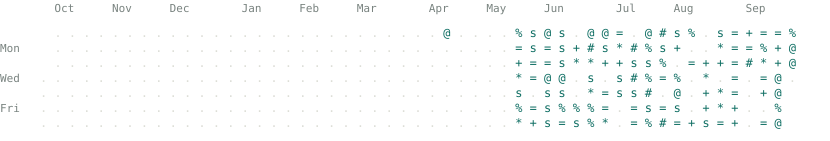
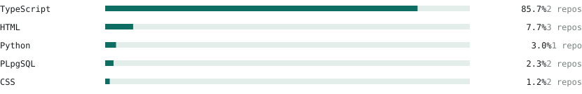

<picture>
  <source media="(prefers-color-scheme: dark)" srcset="assets/portrait-dark.svg">
  
</picture>

> Arsh Parekh. Princeton. 
> I build software for public problems.

<picture>
  <source media="(prefers-color-scheme: dark)" srcset="assets/hd-projects-dark.svg">
  
</picture>

**[Patchr](https://github.com/arshsparekh/Patchr-Fixing-New-Jersey-s-Roads)** 
Fixing New Jersey's roads. 
<samp>typescript · postgres</samp>

**[HoagieFunctions](https://github.com/arshsparekh/hoagiefunctions)** 
A prototype for Princeton's Hoagie. 
<samp>typescript · postgres</samp>

**[SecondEye](https://github.com/arshsparekh/SecondEye)** 
A demo. 
<samp>html</samp>

<picture>
  <source media="(prefers-color-scheme: dark)" srcset="assets/hd-activity-dark.svg">
  
</picture>

<picture>
  <source media="(prefers-color-scheme: dark)" srcset="assets/stats-dark.svg">
  
</picture>

<picture>
  <source media="(prefers-color-scheme: dark)" srcset="assets/year-dark.svg">
  
</picture>

<picture>
  <source media="(prefers-color-scheme: dark)" srcset="assets/langs-dark.svg">
  
</picture>

Every graphic here is drawn by this repository. A nightly action redraws the activity from the GitHub API.
